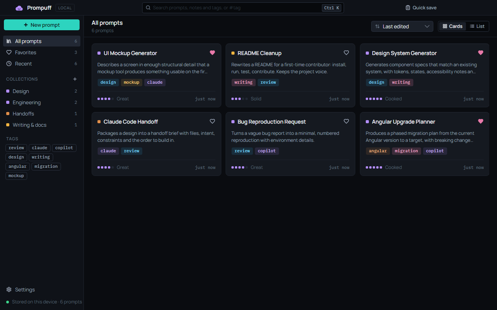
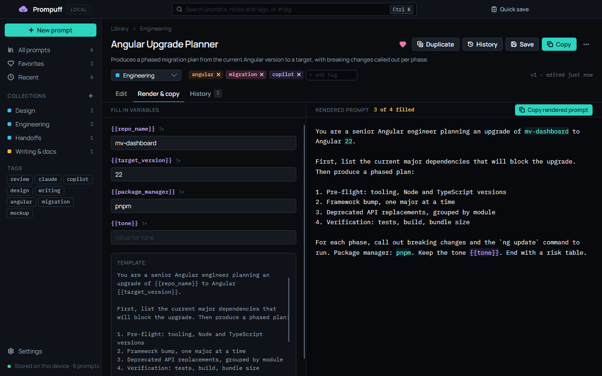

<h1>
  <picture>
    <source media="(prefers-color-scheme: dark)" srcset="docs/brand/lockup-dark.svg">
    
  </picture>
</h1>

> *Talk is cheap. Show me the prompts.*
>
> — Puff, with apologies to Linus Torvalds

**A local-first home for prompts worth keeping.**

Prompuff is a small desktop app for the prompts that actually worked. Save them, tag them, fill in their `{{variables}}`, copy the result, and keep a note on why each one worked. Every saved change becomes a version you can read back or restore.

Your prompts stay on your machine. There is no account, no cloud and no telemetry.

> **Status:** [v0.1.2 is out](https://github.com/hazeliscoding/prompuff/releases/latest) for Windows x64 and Linux x64. macOS (Intel and Apple Silicon) and Linux ARM64 come in v0.3, and [ROADMAP.md](ROADMAP.md) has the road to 1.0.





## What it does

- **Keeps** prompts with a title, description, body, notes ("why this worked"), a collection, tags, a favorite flag and a 1–5 usefulness rating.
- **Renders** `{{variable_name}}` placeholders. Fill in the values, watch the preview update, and copy the result. Unfilled variables stay as `{{tokens}}`, and each prompt remembers its values until you clear them.
- **Versions** every saved change to the title, description, body or notes. The History tab shows a line diff, and Restore brings an old version back as a new one.
- **Finds** prompts fast: ranked search across titles, descriptions, bodies, notes and tags that ignores case and accents ("cafe" finds "Café"), or type `#tag`. Filter by Favorites, Recent, a collection or a tag.
- **Captures** quickly: Quick save (Ctrl+Shift+S) starts from whatever is on your clipboard.
- **Travels** as plain Markdown with a small metadata block. Export what you're looking at as one `.zip` for another machine or a teammate; importing it skips prompts you already have.
- **Forgives**: deleted prompts wait 30 days in Recently deleted, and the library is backed up once a day.

## Supported platforms

| Platform | Package |
|---|---|
| Windows x64 (10 and 11) | `Prompuff-Setup.exe`, installed per user with automatic updates |
| Linux x64 (X11, or Wayland through XWayland) | `Prompuff-linux-x64.AppImage` |

Both are self-contained, so you don't need to install .NET. macOS (Intel and Apple Silicon) and Linux ARM64 come in v0.3.

On Linux:

```bash
chmod +x Prompuff-linux-x64.AppImage
./Prompuff-linux-x64.AppImage
```

If your distribution doesn't ship FUSE 2, run it with `APPIMAGE_EXTRACT_AND_RUN=1` set.

## Keyboard shortcuts

| Keys | Action |
|---|---|
| Ctrl+K or Ctrl+Shift+P | Command palette: open, copy, or run a command |
| Ctrl+N | New prompt |
| Ctrl+S | Save |
| Ctrl+F | Search |
| Ctrl+Enter | Open Render, then copy the rendered prompt |
| Ctrl+Shift+C | Copy the template with its variables |
| Ctrl+Shift+S | Quick save from the clipboard |
| Ctrl+D | Toggle favorite |
| Ctrl+H | Version history |
| Esc | Close a dialog or the palette |

## Development

### Requirements

- [.NET 10 SDK](https://dotnet.microsoft.com/download) (10.0.100 or later).
- Windows 10 or 11, or a Linux desktop with X11 libraries. On Debian or Ubuntu: `sudo apt install libx11-6 libice6 libsm6 libfontconfig1`.
- Packaging only: the Velopack CLI, pinned as a local tool. `dotnet tool restore` installs it.

### Build, test and run

```bash
dotnet restore
dotnet build
dotnet test
dotnet run --project src/Prompuff.App
```

To keep a development run away from your real library, point Prompuff at another folder:

```bash
PROMPUFF_DATA_DIR=/tmp/prompuff-dev dotnet run --project src/Prompuff.App
```

In PowerShell, use `$env:PROMPUFF_DATA_DIR = "$env:TEMP\prompuff-dev"`. The prompts in [`samples/`](samples) can be imported from Settings › Import / export.

The UI tests drive the real main window headlessly. Set `PROMPUFF_SCREENSHOTS` to a folder to save a PNG of each state they visit:

```bash
PROMPUFF_SCREENSHOTS=./screenshots dotnet test tests/Prompuff.App.Tests
```

### Project structure

| Project | What it holds |
|---|---|
| `src/Prompuff.Domain` | Entities and pure rules: prompts, versions, collections, tag normalization. No dependencies. |
| `src/Prompuff.Application` | Interfaces and services: template rendering, versioning, collections, line diff. No UI or database code. |
| `src/Prompuff.Infrastructure` | SQLite repositories and migrations, FTS5 search, backups, Markdown import and export, data paths, settings, file logging, Velopack updates. |
| `src/Prompuff.App` | The Avalonia app: views, view models, controls, theme tokens, and platform services for the clipboard, file pickers and launcher. |
| `tests/*` | xUnit tests for each layer, plus headless UI tests for the app. |

## Local storage

| | Library, logs and backups | Settings |
|---|---|---|
| Windows | `%LOCALAPPDATA%\Prompuff\` | `%LOCALAPPDATA%\Prompuff\settings.json` |
| Linux | `$XDG_DATA_HOME/prompuff/` (default `~/.local/share/prompuff/`) | `$XDG_CONFIG_HOME/prompuff/settings.json` (default `~/.config/prompuff/`) |

The library is one SQLite file, `prompuff.db`. Prompuff never writes next to its executable or inside the AppImage, so updates and reinstalls leave your prompts alone. Prompuff copies the library to `backups/` once a day and keeps the last 30, plus a copy before a new version changes the database format. Settings › Storage shows the folder and lists the backups, and restoring one copies the current library aside first.

## Packaging

Both platforms publish self-contained and are packed with [Velopack](https://velopack.io). The pack ID is `Prompuff.Desktop`: Velopack installs to `%LocalAppData%\Prompuff.Desktop`, which keeps the app apart from the data folder.

Windows (run on Windows):

```powershell
dotnet tool restore
dotnet publish src/Prompuff.App -c Release -r win-x64 --self-contained true -p:Version=0.1.0 -o artifacts/publish/win-x64
dotnet vpk pack --packId Prompuff.Desktop --packVersion 0.1.0 --packDir artifacts/publish/win-x64 `
  --mainExe Prompuff.exe --packTitle Prompuff --icon src/Prompuff.App/Assets/prompuff.ico `
  --channel win --outputDir artifacts/releases/win
```

This writes `Prompuff.Desktop-win-Setup.exe`, a portable zip, and the update files (`*-full.nupkg`, `releases.win.json`, `RELEASES`).

Linux AppImage (run on Linux):

```bash
dotnet tool restore
dotnet publish src/Prompuff.App -c Release -r linux-x64 --self-contained true -p:Version=0.1.0 -o artifacts/publish/linux-x64
dotnet vpk pack --packId Prompuff.Desktop --packVersion 0.1.0 --packDir artifacts/publish/linux-x64 \
  --mainExe Prompuff --packTitle Prompuff --icon src/Prompuff.App/Assets/prompuff.png \
  --categories "Utility;Development" --channel linux --outputDir artifacts/releases/linux
```

This writes the `.AppImage` and its update files (`*-full.nupkg`, `releases.linux.json`).

## Releases

1. Set the version in `Directory.Build.props` and commit.
2. Tag and push: `git tag v0.1.0 && git push origin v0.1.0`.
3. The [Release workflow](.github/workflows/release.yml) tests and packs both platforms, starts the AppImage under Xvfb as a smoke test, and opens a **draft** GitHub Release. It holds `Prompuff-Setup.exe`, `Prompuff-linux-x64.AppImage`, a portable Windows zip and the Velopack update files.
4. Read the draft and publish it. Installed copies only see published releases.

Running the workflow by hand from the Actions tab builds the same artifacts without publishing anything.

## Privacy

Prompuff stores prompts locally and does not upload prompt content.

- No account, telemetry, analytics or AI calls.
- The only network request is the update check against this repository's GitHub Releases. It sends nothing about your library, and you can turn it off in Settings › Updates.
- Logs record prompt IDs and counts, never titles, bodies, notes or variable values.

## License

[MIT](LICENSE). Manrope and IBM Plex Mono are under the SIL Open Font License, and the icons are from [Lucide](https://lucide.dev) (ISC). See [`licenses/`](licenses).
